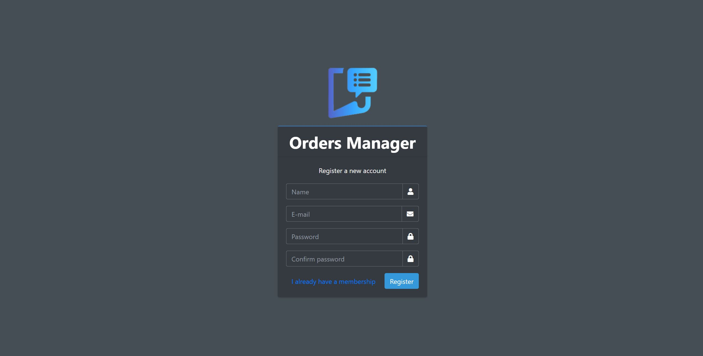
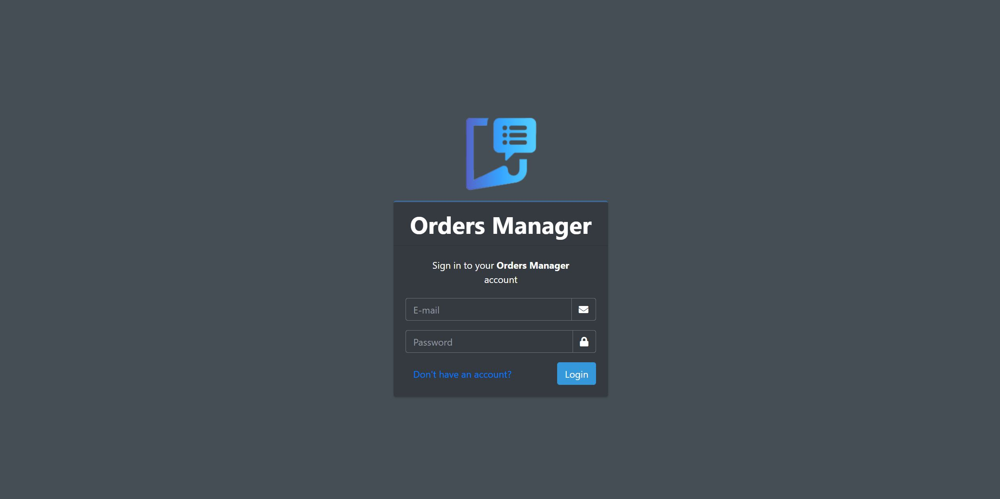
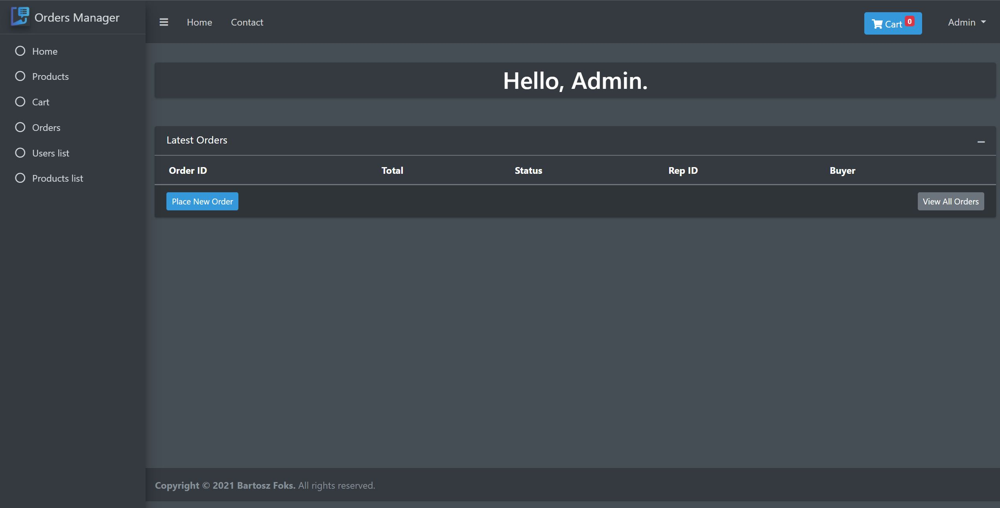
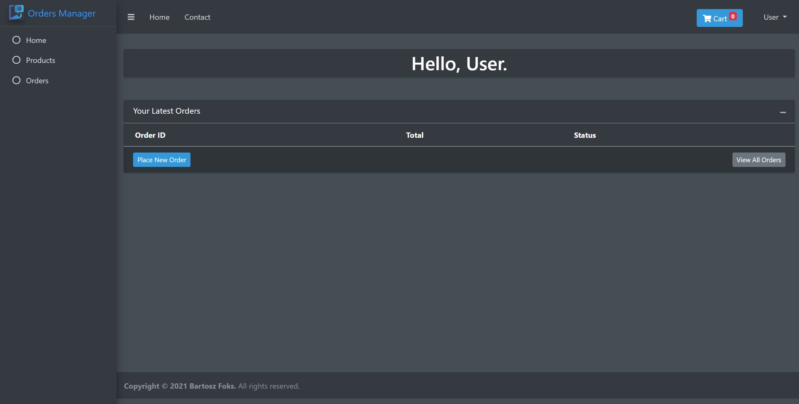
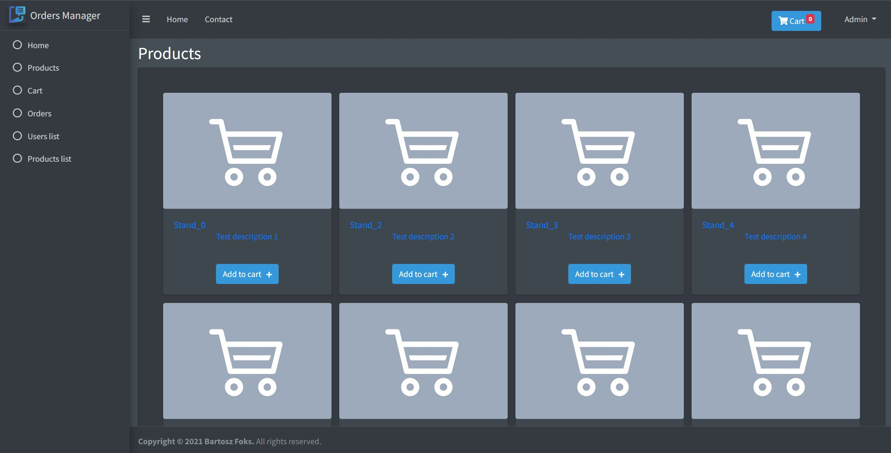
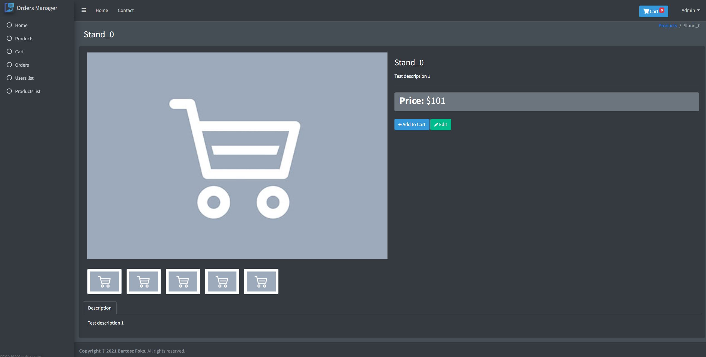

    
     

<h1 align="center"> Orders Manager </h1>

   This is my final project for Laravel - MVC classes at Collegium da Vinci. 

   This application purpose is to take orders from clients by sales representatives and manage them by orders manager.

# Functionalities

There are two types of users. Depending on user type you are able to do different things.

User
<ol> 
    <li> Registering an account </li>
    <li> Logging to an account </li>
    <li> Viewing, adding and removing products in cart </li>
    <li> Placing orders </li>
    <li> Viewing placed orders </li>
    <li> Viewing products </li>  
</ol>

Admin
<ol> 
    <li> Logging to an account defined as Admin</li>
    <li> Viewing, adding and removing products in cart </li>
    <li> Placing orders </li>
    <li> Viewing placed orders </li>
    <li> Modifying users orders status </li>
    <li> Adding, editing, deleting products </li>
    <li> Viewing products </li> 
    <li> Viewing users list </li> 
</ol>
 
## Register

---

## Login

---

## Main screens

<i> Admin screen </i>

  

<i> User screen </i>

---

## Products

<i> Products list </i>

  

<i> Product screen </i>

---

## Cart

---

## Orders

<i> Placing order </i>

<i> Changing order status </i>

<i> Deleting order </i>

---

# About

<i>Author: <a href="https://github.com/bfokss">bfokss</a>

<i>Used technologies :</i>

<ul>
    <li> Laravel   </li>
    <li> Xampp </li>
    <li> Bootstrap </li>
    <li> AdminLTE </li>
</ul>

